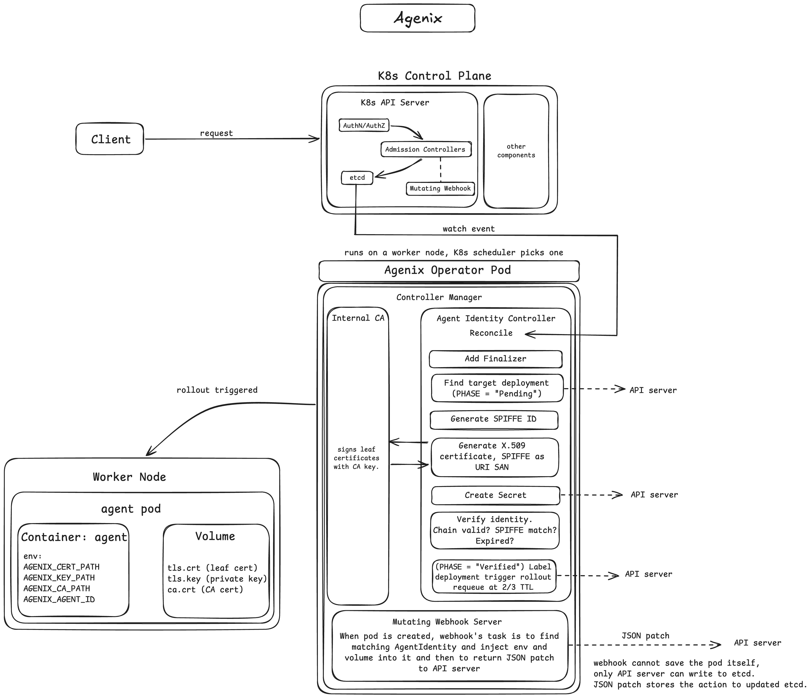
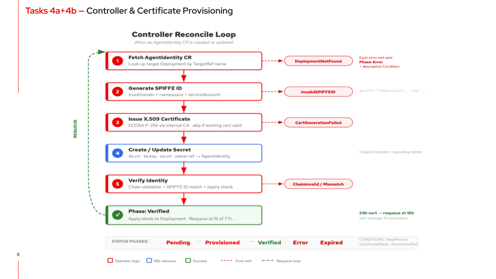

# Agenix — Automated Agent Identity Operator

**A Kubernetes operator that automates cryptographic identity provisioning for AI agents.**

Built at **Red Hat** | AI Agent Ops Team | Summer 2026

**Grace Smith** — [GitHub](https://github.com/gracesmith6504)

---

## What is Agenix?

In AI agent-to-agent systems, every workload needs a verifiable identity — but managing certificates manually doesn't scale. Agenix is a Kubernetes operator that solves this: you deploy an agent and create one custom resource, and the operator handles X.509 certificate issuance, SPIFFE ID generation, pod injection via webhook, rotation, and cleanup automatically.

The design uses composition over inheritance — the CRD references a target Deployment by name rather than embedding its spec, keeping identity concerns decoupled from workload configuration. Agenix is a simplified, educational take on production patterns from Red Hat's [Kagenti Operator](https://github.com/kagenti/kagenti).

> **This is my fork.** The upstream repo is [Bobbins228/Agenix](https://github.com/Bobbins228/Agenix). All PRs linked below were merged into upstream — I'm using this fork to showcase my contributions.

---

## My Contributions

I built the CRD, controller, and certificate provisioning pipeline — the core reconciliation path from "user creates a resource" to "agent pod has a verified cryptographic identity."

| PR | What I Built | Lines | Key Concepts |
|---|---|---|---|
| [#1](https://github.com/Bobbins228/Agenix/pull/1) | **CRD Design & Project Scaffolding** | +3,990 | Kubebuilder, OpenAPI v3 schema, `metav1.Time`, printcolumn markers, composition over inheritance |
| [#2](https://github.com/Bobbins228/Agenix/pull/2) | **CI Pipeline Fix** | +16 | GitHub Actions workflow path + go-version-file fix |
| [#5](https://github.com/Bobbins228/Agenix/pull/5) | **Controller Scaffolding** — CA init, RBAC, watches | +221 | Reconciliation loop, `For()`/`Owns()` watches, RBAC markers, status subresource |
| [#6](https://github.com/Bobbins228/Agenix/pull/6) | **Certificate Provisioning** in reconcile loop | +426 | X.509/ECDSA P-256, SPIFFE IDs, `CreateOrUpdate`, owner references, `RequeueAfter` at 2/3 TTL |
| [#13](https://github.com/Bobbins228/Agenix/pull/13) | **OpenShift Security Context** fix | +11 | `restricted-v2` SCC compliance, `runAsNonRoot`, `seccompProfile`, `ubi9-minimal` |
| — | **OpenShift Deployment & Validation** | — | Cross-arch build (ARM→AMD64), `quay.io` registry, ROSA HCP cluster, wrote [deployment guide](#openshift-deployment-guide) |

**Also:** Reviewed teammate's [PR #3](https://github.com/Bobbins228/Agenix/pull/3) — identified a SPIFFE ID validation bug before merge.

**Total: ~4,660 lines of Go across 5 merged PRs**, plus OpenShift deployment work and code review.

---

## Architecture

The operator follows the standard Kubernetes controller pattern:

1. Developer creates an `AgentIdentity` CR referencing a target `Deployment`
2. The **Controller** detects it via `For()` watch and enters the reconcile loop
3. Reads the target Deployment and its ServiceAccount
4. Generates a **SPIFFE ID** (`spiffe://<trustDomain>/ns/<namespace>/sa/<serviceAccount>`)
5. Issues an **X.509 certificate** (ECDSA P-256, signed by the in-process CA)
6. Stores cert material in a Kubernetes **Secret** with owner references
7. **Verifies** the certificate chain and SPIFFE ID → sets status to `Verified`
8. The **Mutating Webhook** intercepts pod creation and injects the TLS secret as a volume mount + environment variables
9. On deletion, a **Finalizer** cleans up the Secret, labels, and Deployment patches

---

## How the Reconcile Loop Works

Each step has error handling with descriptive status conditions. Certificate rotation requeues automatically at 2/3 of the TTL — so a 24-hour cert requeues after 16 hours. The controller uses `controllerutil.CreateOrUpdate` for idempotent Secret management, meaning it converges safely even if restarted mid-reconcile.

---

## Demo Videos

<!-- TODO: Replace with your YouTube URLs after uploading -->

| Demo | Link |
|---|---|
| Kind Cluster Demo | [YouTube](YOUR_KIND_DEMO_YOUTUBE_URL) |
| OpenShift (ROSA) Demo | [YouTube](YOUR_OPENSHIFT_DEMO_YOUTUBE_URL) |
| Full Demo Presentation | [Google Slides](YOUR_SLIDES_GOOGLE_DRIVE_URL) |

---

## Technical Deep Dives

I wrote detailed walkthroughs for each major task, documenting design decisions, bugs I found, and what I learned:

<!-- TODO: Replace with your Google Drive share links -->

| Walkthrough | What It Covers |
|---|---|
| [Task 1: CRD Design](YOUR_TASK1_WALKTHROUGH_DRIVE_URL) | Kubebuilder scaffolding, OpenAPI schema, composition vs inheritance, 4 bugs found and fixed |
| [Task 4a: Controller Scaffolding](YOUR_TASK4A_WALKTHROUGH_DRIVE_URL) | Reconciliation loop, CA initialization, RBAC markers, `For()`/`Owns()` watches, 3 bugs |
| [Task 4b: Certificate Provisioning](YOUR_TASK4B_WALKTHROUGH_DRIVE_URL) | X.509 generation, SPIFFE IDs, `CreateOrUpdate`, owner refs, 5 integration tests, 6 bugs |
| [OpenShift Deployment Guide](YOUR_DEPLOYMENT_GUIDE_DRIVE_URL) | Cross-arch builds, SCC compliance, ROSA HCP deployment, validation steps |

---

## What I Learned

Beyond the code, I intentionally broke things to understand how they work. Highlights from 15 pages of learning exercises across all tasks:

- **Deleting a CRD cascades to ALL custom resources of that type** — they cannot be recovered. The CRD is the definition; without it, Kubernetes can't keep any instances.
- **Chain validation fails when a leaf cert is self-signed** — the CA proves the identity is legitimate. Without chain validation, any agent could forge its own identity.
- **Owner references vs finalizers serve different purposes** — owner refs handle same-namespace garbage collection automatically; finalizers are needed when cleanup spans namespaces or involves external resources. You need both.
- **Manually removing a finalizer is dangerous** — it tells Kubernetes "cleanup is done" when the cleanup logic hasn't actually run, leaving orphaned resources behind.
- **`For()` vs `Owns()` watches** — `For()` triggers reconcile when the primary resource changes; `Owns()` triggers reconcile of the *owner* when a child resource (like a Secret) changes. Getting this wrong means the controller misses updates.

---

## Technologies

Go, Kubernetes, Kubebuilder, controller-runtime, X.509 / SPIFFE, ECDSA P-256, Ginkgo / Gomega, envtest, GitHub Actions, OpenShift / ROSA HCP, Kustomize, Podman, cert-manager

---

## About the Project

Agenix was built as a team intern project at Red Hat by three interns on the AI Agent Ops team. The upstream repo is [Bobbins228/Agenix](https://github.com/Bobbins228/Agenix). I built the CRD, controller, and certificate provisioning (Tasks 1, 4a, 4b), plus OpenShift deployment. Other team members built the CA, webhook, verification, SPIFFE utilities, and finalizer/lifecycle management.

For the full project README (setup instructions, API reference, architecture details), see the [upstream repo](https://github.com/Bobbins228/Agenix).
