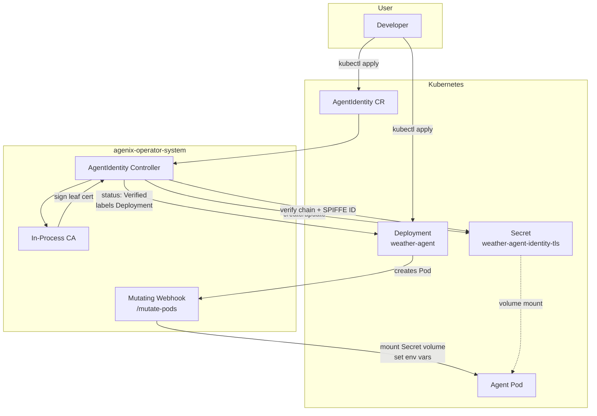

# Agenix

**Deploy an AI agent to Kubernetes. It automatically gets a cryptographic identity. No manual certificate management. No config files. Just deploy and it's trusted.**

Agenix is a Kubernetes operator that automatically provisions and manages cryptographic identities for AI agent workloads. It is a simplified take on the [Kagenti Operator](https://github.com/kagenti/kagenti), focused on the core identity automation loop.

| Resource | Link |
| --- | --- |
| Jira Epic | [RHAIENG-5753](https://redhat.atlassian.net/browse/RHAIENG-5753) |
| Design Doc | [Intern Project: Automated Agent Identity Operator](https://docs.google.com/document/d/1cpGHbgpErJiLyK0vsKzOnzqgi77mVDssioYhK8D61W0/edit) |
| Operator Code | [`agenix-operator/`](agenix-operator/) |

## Problem

In agent-to-agent (A2A) systems, every workload must answer: *Who is this agent?* and *Can I trust it?* Manual certificate creation, mounting, rotation, and tracking does not scale beyond a handful of deployments.

Agenix makes identity invisible to the developer. You deploy an agent and create an `AgentIdentity` custom resource; the operator handles certificate issuance, injection, verification, and cleanup.

## What It Does

When you create an `AgentIdentity` that references an agent `Deployment`, the operator:

1. **Detects** the target Deployment and reads its ServiceAccount
2. **Provisions** a unique SPIFFE-style ID and X.509 certificate (signed by an in-process CA)
3. **Stores** the certificate material in a Kubernetes `Secret` (`<name>-tls`)
4. **Injects** the certificate into agent pods via a mutating admission webhook
5. **Verifies** the certificate chain and SPIFFE ID, then updates status to `Verified`
6. **Cleans up** Secrets, labels, and the target Deployment when the `AgentIdentity` is deleted (finalizers)

## Architecture



### Component Overview

| Component | Location | Responsibility |
| --- | --- | --- |
| `AgentIdentity` CRD | `api/v1alpha1/` | Declares identity for a target Deployment (composition over inheritance via `spec.targetRef`) |
| Controller | `internal/controller/` | Reconciles certificates, status, labels, rotation, and finalizer cleanup |
| CA | `internal/ca/` | Self-signed ECDSA P-256 CA; issues leaf certs with SPIFFE URI SAN |
| certutil | `internal/certutil/` | SPIFFE ID generation, certificate bundling, fingerprinting |
| verify | `internal/verify/` | Chain validation and SPIFFE ID matching |
| Pod Mutator | `internal/webhook/` | Injects cert volume and environment variables at pod admission |

### Identity Flow

```
Developer deploys agent
        │
        ▼
Creates AgentIdentity CR ─────────────────────────┐
        │                                         │
        ▼                                         │
┌───────────────────────────┐                    │
│ AgentIdentity Controller  │                    │
│  1. Read CR               │                    │
│  2. Generate SPIFFE ID    │                    │
│  3. Issue X.509 cert      │                    │
│  4. Store in Secret       │                    │
│  5. Verify identity       │                    │
│  6. Label Deployment      │                    │
└─────────────┬─────────────┘                    │
              │                                   │
              ▼                                   │
┌───────────────────────────┐                    │
│   Mutating Webhook        │◄───────────────────┘
│  On Pod CREATE:           │
│  - Find matching CR       │
│  - Mount TLS Secret       │
│  - Set cert env vars      │
└─────────────┬─────────────┘
              │
              ▼
┌───────────────────────────┐
│   Agent Pod               │
│  /var/run/agenix/         │
│    ├── ca.crt             │
│    ├── tls.crt            │
│    └── tls.key            │
│  AGENIX_AGENT_ID=spiffe://│
└───────────────────────────┘
```

## AgentIdentity Custom Resource

**API group:** `agent.agenix.io/v1alpha1`

```yaml
apiVersion: agent.agenix.io/v1alpha1
kind: AgentIdentity
metadata:
  name: weather-agent-identity
  namespace: default
spec:
  targetRef:
    apiVersion: apps/v1
    kind: Deployment
    name: weather-agent
  identity:
    trustDomain: "example.org"
    ttl: "24h"
    autoRotate: true
status:
  phase: Verified          # Pending | Verified | Expired | Error
  agentID: spiffe://example.org/ns/default/sa/weather-agent
  certificate:
    serialNumber: "..."
    notBefore: "..."
    notAfter: "..."
    fingerprint: "sha256:..."
  conditions:
    - type: CertificateReady
      status: "True"
    - type: IdentityVerified
      status: "True"
```

### Status Phases

| Phase | Meaning |
| --- | --- |
| `Pending` | Target Deployment found; provisioning in progress |
| `Verified` | Certificate issued, chain valid, SPIFFE ID matches |
| `Expired` | Certificate past `notAfter` and `autoRotate` is disabled |
| `Error` | Target missing, invalid TTL, verification failure, etc. |

### Labels Applied to Verified Deployments

| Label | Value |
| --- | --- |
| `agenix.io/identity-verified` | `true` |
| `agenix.io/agent-id` | Sanitized SPIFFE ID (DNS-label safe) |

### Pod Environment Variables

When a pod is created for a Deployment with a reconciled `AgentIdentity`, the mutating webhook injects:

| Variable | Value |
| --- | --- |
| `AGENIX_CERT_PATH` | `/var/run/agenix/tls.crt` |
| `AGENIX_KEY_PATH` | `/var/run/agenix/tls.key` |
| `AGENIX_CA_PATH` | `/var/run/agenix/ca.crt` |
| `AGENIX_AGENT_ID` | SPIFFE ID from status |

## Project Structure

```
Agenix/
├── README.md                    # This file
├── .github/workflows/           # CI: lint, unit tests, e2e (Kind)
└── agenix-operator/             # Kubebuilder operator
    ├── api/v1alpha1/            # AgentIdentity CRD types
    ├── cmd/main.go              # Manager entrypoint
    ├── internal/
    │   ├── ca/                  # Certificate Authority
    │   ├── certutil/            # SPIFFE ID + cert generation
    │   ├── controller/          # Reconciliation loop
    │   ├── verify/              # Identity verification
    │   └── webhook/             # Pod mutating webhook
    ├── config/
    │   ├── crd/                 # Generated CRD manifests
    │   ├── samples/             # Example Deployment + AgentIdentity
    │   ├── webhook/             # Webhook configuration
    │   └── default/             # Kustomize overlay (deploy)
    └── test/e2e/                # End-to-end tests
```

GitHub Actions workflows use `working-directory: agenix-operator` and `go-version-file: agenix-operator/go.mod`.

## Prerequisites

- Go 1.26+
- Docker or Podman
- `kubectl` configured for your cluster
- Kubernetes 1.28+ (OpenShift 4.x for demo deployment)
- For local development: [kind](https://kind.sigs.k8s.io/)

## Quick Start (Kind + Podman)

```bash
cd agenix-operator

export CONTAINER_TOOL=podman
export KIND_EXPERIMENTAL_PROVIDER=podman
export IMG=localhost/controller:latest

# 1. Cluster
kind get clusters | grep -q agenix-dev || kind create cluster --name agenix-dev
kubectl config use-context kind-agenix-dev

# 2. Build and load image into Kind (Podman requires image-archive)
make docker-build
podman save -o /tmp/controller-latest.tar $IMG
kind load image-archive /tmp/controller-latest.tar --name agenix-dev

# 3. Install Agenix CRDs, cert-manager, and deploy operator
make install
make install-cert-manager
make deploy IMG=$IMG

# 4. Wait for operator
kubectl wait --for=condition=available deployment/agenix-operator-controller-manager \
  -n agenix-operator-system --timeout=180s

# 5. Deploy sample workload (ServiceAccount + Deployment + AgentIdentity)
kubectl apply -k config/samples/

# 6. Wait for identity verification and automatic pod rollout
kubectl wait --for=jsonpath='{.status.phase}'=Verified \
  agentidentity/weather-agent-identity --timeout=120s
kubectl rollout status deployment/weather-agent --timeout=120s

# 7. Verify
kubectl exec deploy/weather-agent -- ls /var/run/agenix
kubectl exec deploy/weather-agent -- printenv AGENIX_AGENT_ID
```

> **Docker instead of Podman:** omit `KIND_EXPERIMENTAL_PROVIDER` and use `kind load docker-image $IMG --name agenix-dev` after `make docker-build`.
>
> **Podman build OOM:** run `make build` and use a local Dockerfile that copies `bin/manager` instead of compiling inside the container.
>
> When identity reaches `Verified`, the operator patches the Deployment pod template (`agenix.io/cert-fingerprint`) to roll out new pods; the webhook injects certs on pod create.

## Team demo

After the operator is deployed (quick start steps 1–4), run the automated demo script:

```bash
cd agenix-operator
./scripts/demo.sh
```

Re-run from a clean state:

```bash
./scripts/demo.sh --reset
```

Remove sample resources only:

```bash
./scripts/demo.sh --cleanup
```


## Deploy on OpenShift (Demo)

```bash
cd agenix-operator

# Log in and select your project/namespace
oc login <cluster-url> --token=<token>
oc new-project agenix-demo || oc project agenix-demo

# Build and push to OpenShift internal registry or Quay
export IMG=image-registry.openshift-image-registry.svc:5000/agenix-demo/agenix-operator:latest
make docker-build docker-push IMG=$IMG

# Install CRDs, cert-manager, and deploy operator
make install
make install-cert-manager
make deploy IMG=$IMG

# Deploy demo workload
oc apply -k config/samples/

# Demo verification commands
oc get agentidentity
oc describe agentidentity weather-agent-identity
oc get secret weather-agent-identity-tls
oc exec deploy/weather-agent -- ls /var/run/agenix
```

> **Note:** The default Kustomize overlay deploys into `agenix-operator-system` with cert-manager managing webhook certificates. Ensure cert-manager is available on the cluster (OpenShift clusters often have it pre-installed or available via OperatorHub).

## Cleanup

```bash
kubectl delete -k config/samples/
make undeploy
make uninstall
```

Deleting the `AgentIdentity` triggers finalizer cleanup: TLS Secret removal, identity labels removed from the Deployment, and the target Deployment deleted.

## Testing

```bash
cd agenix-operator

make test          # Unit + integration tests (envtest)
make lint-fix      # golangci-lint

# E2E (requires isolated Kind cluster) CI oriented - runs on every PR. To run locally, 'make test-e2e' (Docker + Kind required)
make setup-test-e2e
make test-e2e
```

CI runs lint, unit tests, and e2e on pull requests via `.github/workflows/`.

## Comparison with Kagenti Operator

| Aspect | Kagenti Operator | Agenix |
| --- | --- | --- |
| CRDs | AgentRuntime, AgentCard | AgentIdentity |
| Controllers | 6 | 1 |
| Webhooks | Validating + mutating (sidecar injection) | Mutating only (volume mount) |
| Identity Provider | SPIRE (external) | Built-in CA |
| Auth | OAuth2/Keycloak + mTLS | Certificate-based |
| Manifests | Helm | Kustomize |

## Technical Stack

| Technology | Purpose |
| --- | --- |
| Go | Operator implementation |
| Kubebuilder / controller-runtime | Scaffolding and reconciliation |
| Kustomize | Manifest management |
| `crypto/x509` | Certificate generation |
| cert-manager | Webhook TLS certificates |
| kind | Local development and CI e2e |
| OpenShift | Demo / production-like environment |
| Ginkgo / Gomega | Test framework |

## References

- [Kubebuilder Book](https://book.kubebuilder.io)
- [SPIFFE Concepts](https://spiffe.io/docs/latest/spiffe-about/overview/)
- [Kagenti Operator](https://github.com/kagenti/kagenti) (reference implementation)
- [Design Document](https://docs.google.com/document/d/1cpGHbgpErJiLyK0vsKzOnzqgi77mVDssioYhK8D61W0/edit)

## License

Apache License 2.0. See [agenix-operator/README.md](agenix-operator/README.md) for details.
